# SCAR - (Software de Condomínio Adaptado a Residência)

## Telas e sua funcionalidades: 

### Tela Login
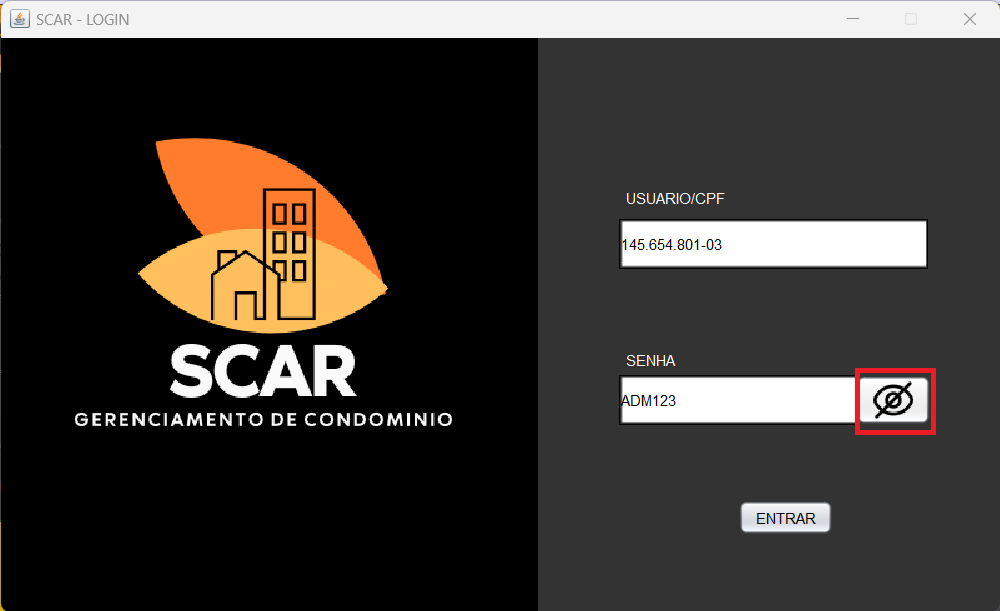
* Ao digitar cpf e senha e clicar em cadastrar será chamada o método de autenticação de login
* Caso o usuário seja Síndico ou Porteiro, e digitar cpf e senha corretos, eles prosseguirá
* Caso o Funcionário de outro departamento tente logar, irá aparecer uma mensagem dizendo: "ACESSO NEGADO"
* Conta tambmém com uma pequena função de ocultar ou vizualizar senha 

#### Mensagem de Bem-vindo
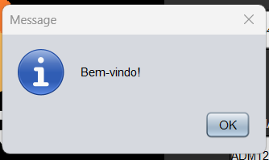
* Caso a autenticação de login dê certo, esta mensagem será exibida e o usuário será lançado para a Tela Home

### Tela Home
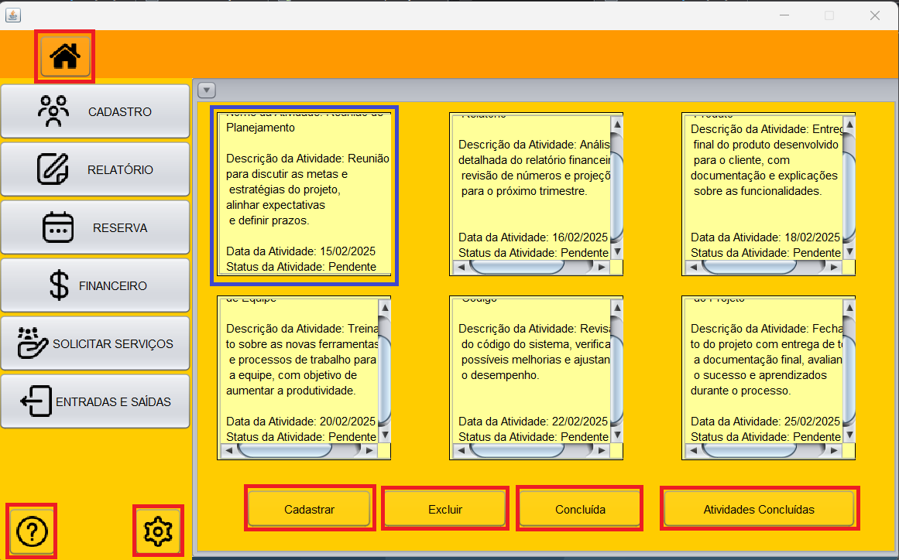
* Na Tela Home no código fonte possui uma função que consegue diferenciar o tipo de usuario, se é porteiro ou se é síndico, se for porteiro ele não terá acesso às telas de
Cadastro, caso ele seja síndico ele pode cadastrar Funcionários, Moradores e Unidades.
* A telaHome é estartada com a tela de Atividades aberta, na tela de Atividades, o Síndico cadastra ou excluir uma atividade e o Porteiro pode marcar a atividade como concluída e possui também a opção
de ver as atividades concluídas.
* Na TelaHome possui um icone de casa que ao navegar para outra tela e apertar no icone Home ele volte para a tela Home.
* Possui também na lateral esquerda 6 botões que levam para suas respectivas telas.
* Na parte inferior possui dois ícones: um de ajuda e outro de configurações.

#### Opções de Cadastro
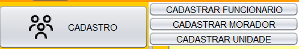
* Ao apertar no Cadastro ele Mostra as opções de cadastro disponíveis.

### Tela Cadastro de Funcionário
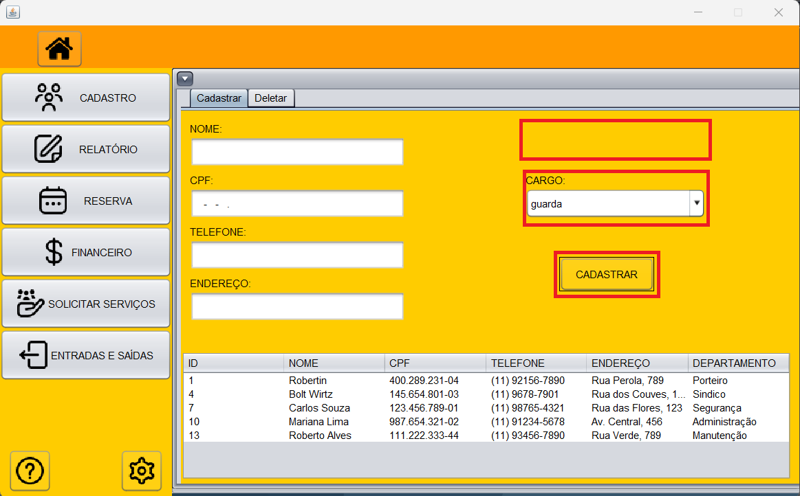
* Em cadastro de Funcionário, ao preencher os campos e chegar no campo de departamento, terá as opções com os departamentos disponíveis, ao clicar em porteiro ou síndico ele tornará visível uma
label e um campo de texto que receberá a senha do funcionário e quando ele for cadastrado ele irá aparecer na tabela abaixo.

### Tela Cadastro de Morador
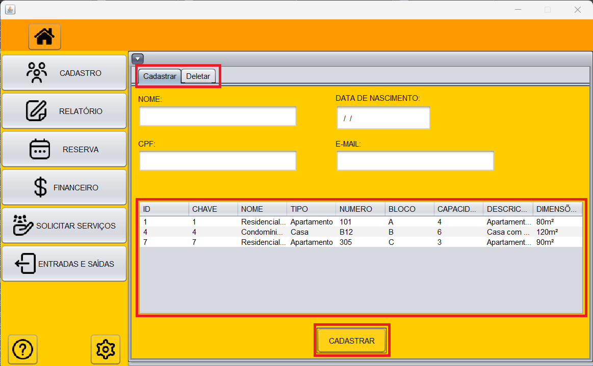
* Na tela de Cadastro de Morador, o usuário preenche os campos e ele só pode ser registrado caso ele tenha uma casa, então existe uma tabela na parte inferior central que traz uma lista de casas
e o Morador será ligado a uma dessas casas quando o usuario preencher os campos clicar na tabela e apertar em cadastrar ele será cadastrado.
*Na parte superior fica duas opções: cadastrar e deletar esta está presente nas telas de funcionário, morador e unidade.

### Tela Cadastro de Unidade
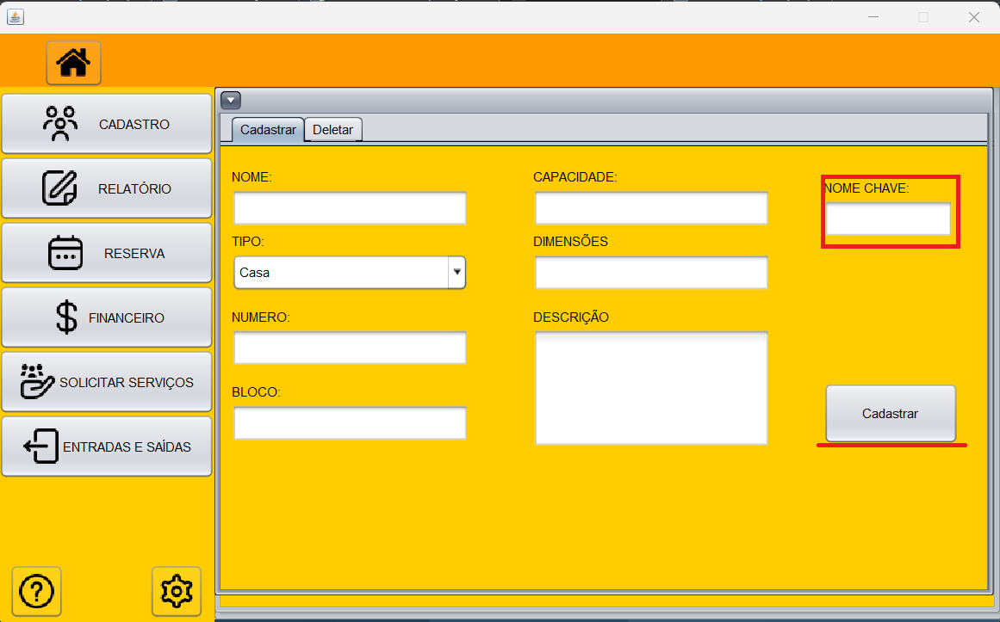
* Nesta tela o usuario deverá preecher os campos acimal, porém toda casa tem uma chave,no banco de dados a chave é uma FOREIGN KEY de Unidade, ou seja antes de ser cadastrada a casa, a chave terá que ser cadastrada primeiro, ao digitar um nome para a chave e apertar em cadastrar automaticamnete essa chave que foi criada será chamada para a Unidade que também acabou de ser criada .

### Tela Deletar
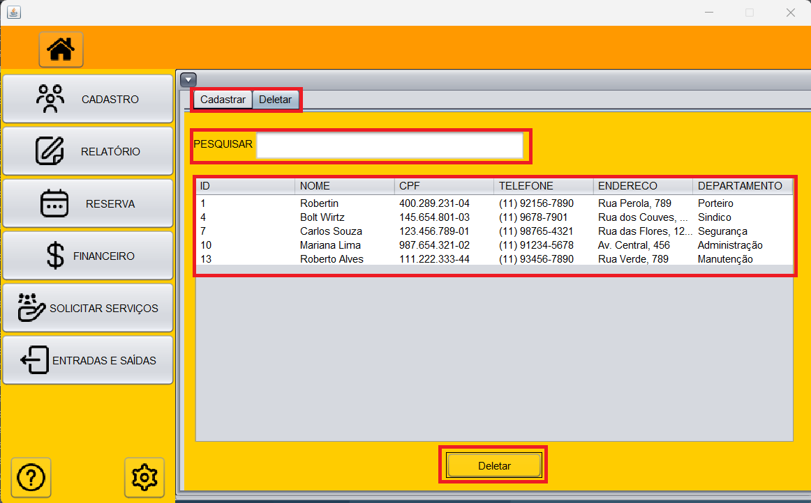
* Existem 3 telas onde podemos deletar ou cadastrar alguma coisa, a lógica de cadastro é diferente, mas as deletações são iguais, então trarei somente esta.
- Na tela de deletar tem uma barra de pequisa onde o usuário pode digitar um nome, então será feito a busca no banco de dados e retornará nomes que tiverem na barra de pesquis após o funcionário achar quem ele deseja deletar, basta ele clicar na tabela onde tem os dados de quem ele quer deletar e então apertar no botão deletar, e os dados da tabela serão excluídos e ele atualizará a tabela sem aquele nome que foi deletado.

### Opções de Relatório
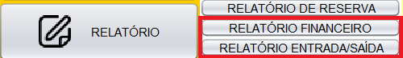
* Voltando para a tela Home, existe um botão chamado "Relatório" onde ele traz consigo 3 opções de relatórios, as duas marcadas de vermelho estão em desenvolvimento, porém é desejável que a de reservas funcione ela vai para a tela de relatório de reservas onde, aparecerá uma tabela com dados das reservas feitas, funcionário que entregou e pegou de volta e a data que foi entregue e desvolvida, como o exemplo abaixo:

- Exemplo de Relatório
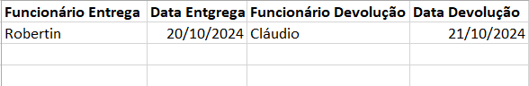

### Opções de Reserva
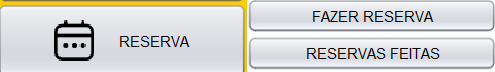
* Novamente voltando a telaHome temos a opção de Reservas onde, tanto porteiro quanto Síndico têm acesso e podem Fazer reservas ou vizualizar as reservas feitas, caso ele aperte em fazer Reserva será conduzido à tela abaixo:

#### Tela de Fazer Reservas
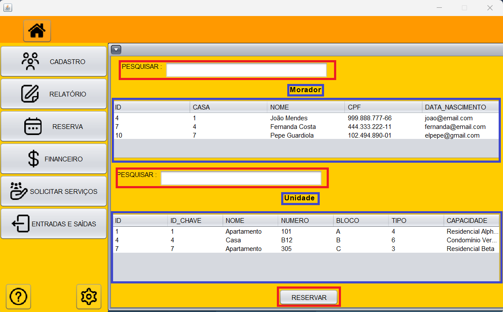
* Aqui é visto 2 tabelas e 2 barras de pesquisar, para fazer uma reserva basta clicar na primeira tabela que é a d Morador, ou seja, escolher o Morador que está fazendo a reserva, tendo a opção de pesquisar o Morador pelo nome, e clicar na tabela inferior que é a de Unidade a qual retorna uma lista de Unidades disponíveis, onde também é possível pesquisar a Unidade pelo nome, e apertar no botão cadastar para fazer a reserva.

### Tela em Desenvolvimento
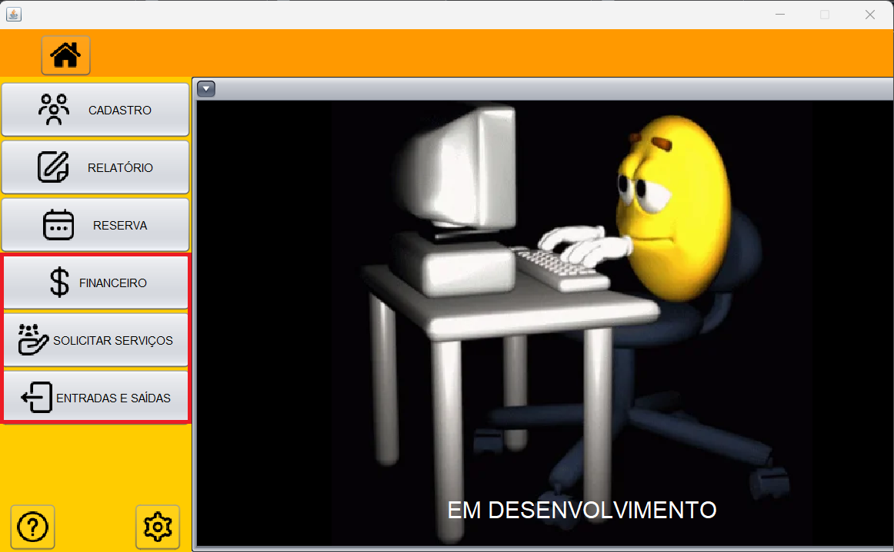
* Atualmente a tela em desenvolvimento são 5: Financeiro, Solicitar serviços, Entradas/Saídas, Relatório financeiro e relatório de Entradas/Saídas
* Esssas telas ficaram planejadas para uma futura integração do nosso sistema com o mobile onde o morador terá uma conta no aplicativo e poderá consultar suas contas, solicitar serviços fazer reservas de forma online e outras diversas funcionalidades.
